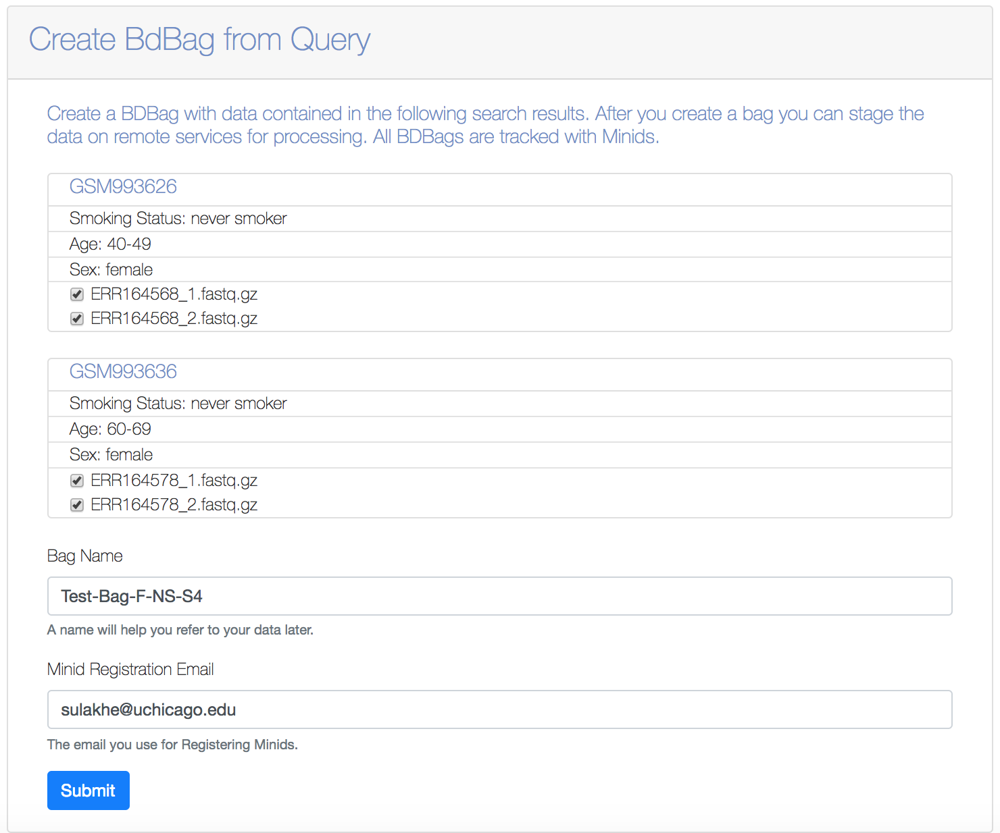

# 3M.5 FULLSTACKS - Test user logon, access data, execute workflow

## Table of Contents
1. [Introduction](#introduction)
1. [Use Case](#use-case)
1. [User Login](#User-Login-to-FAIR-Research-Data-Portal)
1. [Faceted Search](#faceted-search)
    1. [Male Smokers with 4th Stage Lung Cancer](#male-smokers-with-4th-stage-lung-cancer)
    1. [Female Non-Smokers with 4th Stage Lung Cancer](#female-non-smokers-with-4th-stage-lung-cancer)
1. [Analysis of Input Datasets using Workspace](#analysis-of-input-datasets-using-workspace)

## Introduction
This README describes the implementation of a Fullstacks platform that allows a user to login, perform a faceted search and create a workspace to perform secondary and tertiary analysis using workflows and a Jupyter notebook. It allows us to do the following:

* Login to the fullstacks platform using Globus credentials
* Search on GTEx metadata for a faceted search
* Create a inputs BDBag for the search results of interest
* Create a workspace that allows users to start the Topmed RNA-Seq workflow analysis for the inputs BDBag created
* Get the analysis results back into the workspace as a MINID representing a BDBag of outputs. 
* Submit the results to JupyterHub for further interactive downstream analysis

We built upon the previous month deliverable (2M.1 Fullstacks) to introduce many new features in this month’s deliverable. 
* We added a new portal that indexes metadata on various transcriptome RNA samples from lung cancer studies. 
* We added workspace concept within the portal that allows a user to create and manage datasets in the form of BDBags represented by MINID as identifiers; the workspace also allows to perform analytical operations using other tools and platforms such as Globus Genomics and JupyterHub 
* Within the Globus Genomics component that allows analysis of the RNA-Seq data, we introduced a new feature to translate a BDBag into a Galaxy data collection to allow multi-sample analysis in parallel using AWS compute resources
* Globus Genomics uses AWS spot instances and user a scheduling algorithm to select cheapest spot instances across various AWS Regions and Availability Zones. 
* We added a new JupyterHub component that allows further downstream analysis of the transcriptomic data such as a differential expression analysis on multiple samples of RNA-Seq datasets.

## Use case
In this README document, we will demonstrate our platform using the following specific use case: 
1. User Login to the portal using Globus credentials
2. User performs a search using the term “lung”
3. From the results, user filters the samples further by selecting the checkboxes “Stage: 4” that results in 4 samples – 2 male smokers and 2 female non-smokers
4. We will create two BDBags for each of the 2 samples from the results
5. For each BDBag we will create workspace and submit the input BDBag to Globus Genomics to analyze using the TOPMed RNA-Seq Analysis pipeline that provides gene level expression values
6. For each input BDBag (2 male smokers, and 2 female non-smokers) we will get back a output BDBag results in the portal, after the analysis is completed in Globus Genomics.
7. Within the workspace we the submit the two output BDBag to the JupyterHub. 
8. Within JupyterHub, we will access the results of the two analyses and will perform a differential expression analysis between the two sample datasets

## User Login to FAIR Research Data Portal
The FAIR Research data portal is available at: https://globus-portal.fair-research.org and users can login using their Globus ID.

## Faceted Search
The portal indexes lung cancer data available at: https://www.ebi.ac.uk/ena/data/view/PRJEB2784. This data includes metadata such as age, sex, cancer stage, smoking status, and tissue type. Search for the keyword “lung” within the search box on the portal. That results in 159 samples. We will further refine the results to generate two datasets each containing two samples.

### Male Smokers with 4th Stage Lung Cancer
By selecting the metadata check boxes: “Sex: Male”, “Smoking Status: Smoker”, “Stage: 4”, we get two samples. These are RNA-Seq transcriptomic datasets for lung tissue. The screenshot below shows the results:

Create a BDBag for the selected search results by clicking on the Create Cohort button. We will name the BDBag for this cohort of patients as “Test-Bag-M-S-S4”

### Female non-smokers with 4th Stage Lung Cancer
Similarly, Create a BDBag for a cohort representing female non-smokers with 4th stage lung cancer. Let's name the BDBag "Test-Bag-F-NS-S4". 

## Analysis of Input Datasets using Workspace
The portal allows to create Workspaces that can handle analyses of the datasets represented by the BDBags. A workspace can be used to access all the input data bags as well as output data bags from the results of analysis. In this example, we will create a Workspace for each of the the two input bags created in the previous section and analyze using the TOPMed RNA-Seq pipeline within Globus Genomics. The outputs of the RNA-Seq analysis pipeline for both the datasets are then accessed as BDBags (MINIDs) within the workspace. Both the output bags are submitted to the JupyterHub for further downstream analysis using tools such as DeSeq for differential expression analysis of the two datasets.
We used the TOPMed RNA-Seq pipeline that is show below. More details can be found at: https://github.com/broadinstitute/gtex-pipeline/blob/master/TOPMed_RNAseq_pipeline.md 

