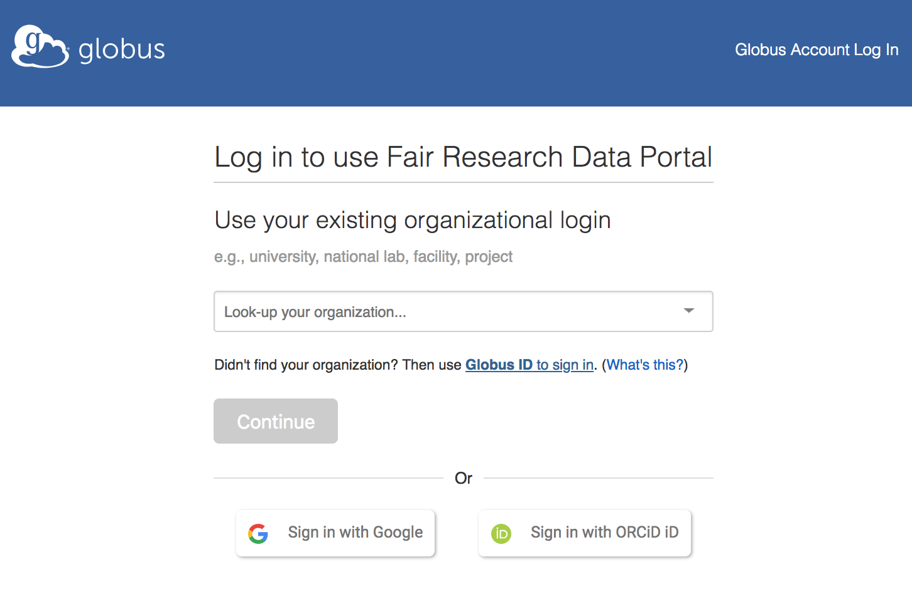
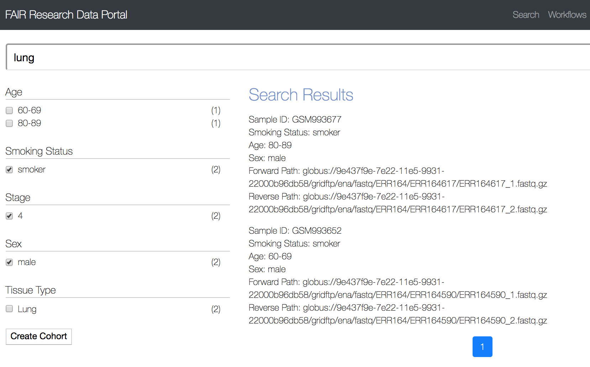
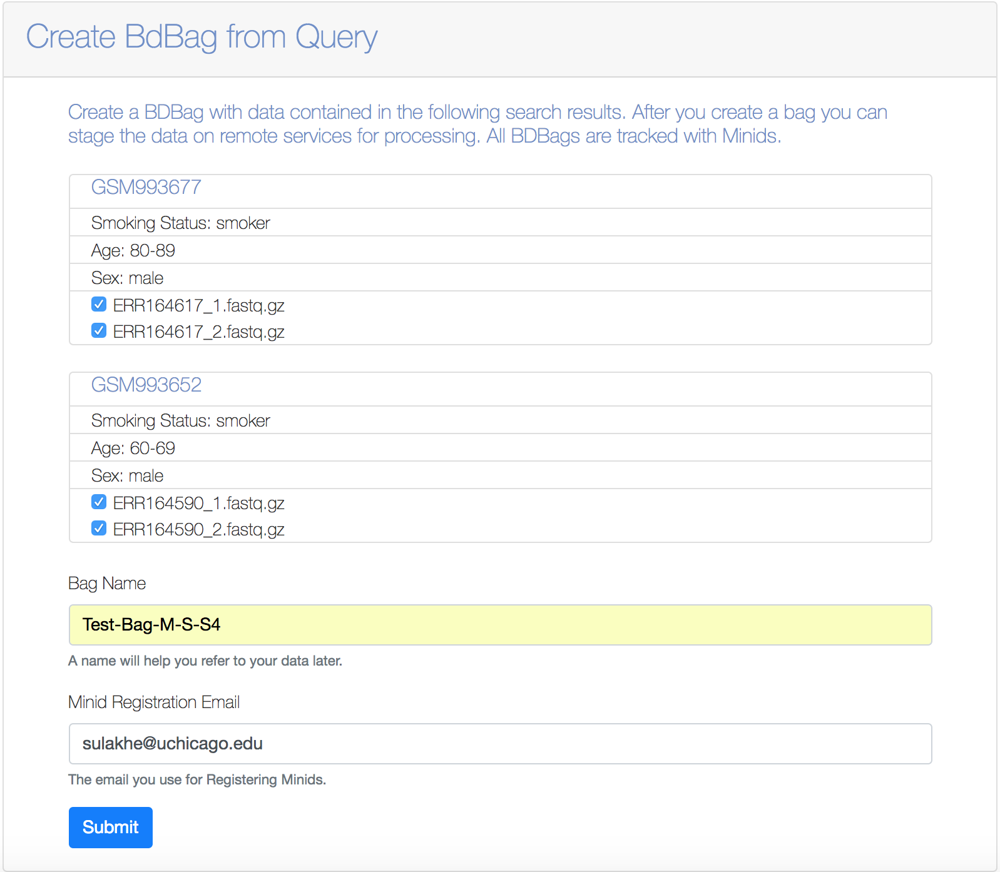
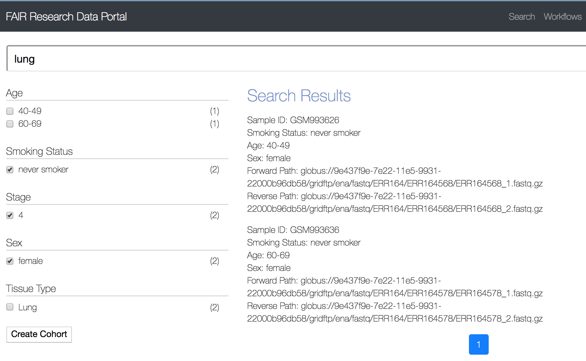
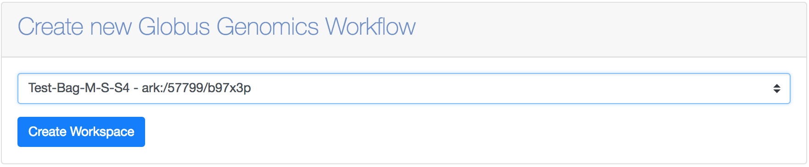
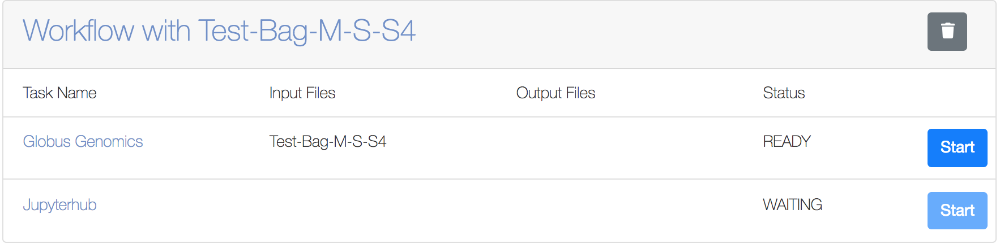
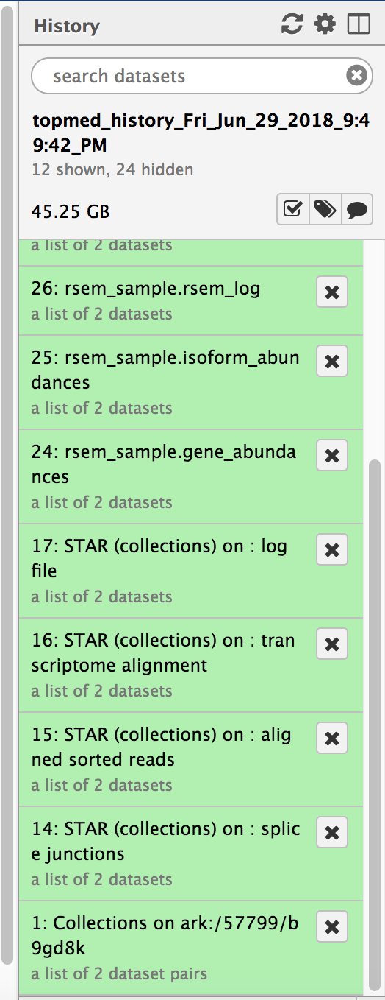
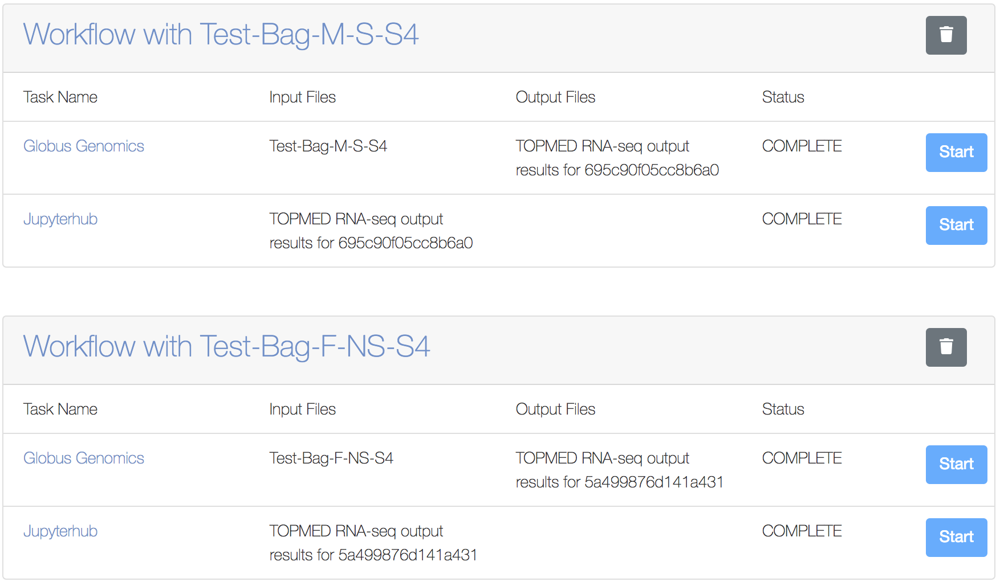
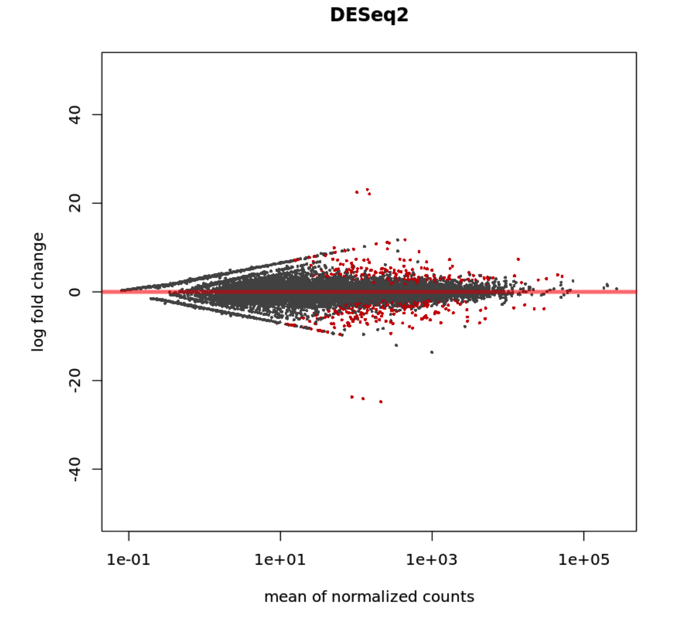
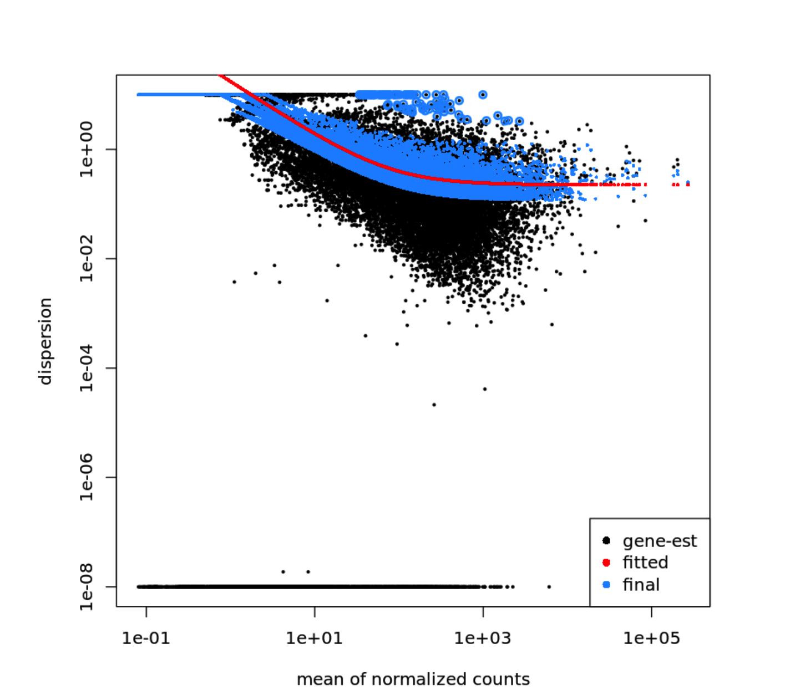

# 3M.5 FULLSTACKS - Test user logon, access data, execute workflow

## Table of Contents
1. [Introduction](#introduction)
1. [Use Case](#use-case)
1. [User Login](#User-Login-to-FAIR-Research-Data-Portal)
1. [Faceted Search](#faceted-search)
    1. [Male Smokers with 4th Stage Lung Cancer](#male-smokers-with-4th-stage-lung-cancer)
    1. [Female Non-Smokers with 4th Stage Lung Cancer](#female-non-smokers-with-4th-stage-lung-cancer)
1. [Analysis of Input Datasets using Workspace](#analysis-of-input-datasets-using-workspace)
    1. [TOPMed RNA-Seq analysis pipeline](#topmed-rna-seq-analysis-pipeline)
    1. [Analysis using Globus Genomics](#analysis-using-globus-genomics)
    1. [Analysis using JupyterHub](#analysis-using-jupyterhub)
    1. [Results of Analysis](#results-of-analysis)
    
    

## Introduction
This README describes the implementation of a Fullstacks platform that allows a user to login, perform a faceted search and create a workspace to perform secondary and tertiary analysis using workflows and a Jupyter notebook. It allows us to do the following:

* Login to the fullstacks platform using Globus credentials
* Search on GTEx metadata for a faceted search
* Create a inputs BDBag for the search results of interest
* Create a workspace that allows users to start the Topmed RNA-Seq workflow analysis for the inputs BDBag created
* Get the analysis results back into the workspace as a MINID representing a BDBag of outputs. 
* Submit the results to JupyterHub for further interactive downstream analysis

We built upon the previous month deliverable (2M.1 Fullstacks) to introduce many new features in this month’s deliverable. 
* We added a new portal that indexes metadata on various transcriptome RNA samples from lung cancer studies. 
* We added workspace concept within the portal that allows a user to create and manage datasets in the form of BDBags represented by MINID as identifiers; the workspace also allows to perform analytical operations using other tools and platforms such as Globus Genomics and JupyterHub 
* Within the Globus Genomics component that allows analysis of the RNA-Seq data, we introduced a new feature to translate a BDBag into a Galaxy data collection to allow multi-sample analysis in parallel using AWS compute resources
* Globus Genomics uses AWS spot instances and user a scheduling algorithm to select cheapest spot instances across various AWS Regions and Availability Zones. 
* We added a new JupyterHub component that allows further downstream analysis of the transcriptomic data such as a differential expression analysis on multiple samples of RNA-Seq datasets.

## Use case
In this README document, we will demonstrate our platform using the following specific use case: 
1. User Login to the portal using Globus credentials
2. User performs a search using the term “lung”
3. From the results, user filters the samples further by selecting the checkboxes “Stage: 4” that results in 4 samples – 2 male smokers and 2 female non-smokers
4. We will create two BDBags for each of the 2 samples from the results
5. For each BDBag we will create workspace and submit the input BDBag to Globus Genomics to analyze using the TOPMed RNA-Seq Analysis pipeline that provides gene level expression values
6. For each input BDBag (2 male smokers, and 2 female non-smokers) we will get back a output BDBag results in the portal, after the analysis is completed in Globus Genomics.
7. Within the workspace we the submit the two output BDBag to the JupyterHub. 
8. Within JupyterHub, we will access the results of the two analyses and will perform a differential expression analysis between the two sample datasets

## User Login to FAIR Research Data Portal
The FAIR Research data portal is available at: https://globus-portal.fair-research.org and users can login using their Globus ID.


## Faceted Search
The portal indexes lung cancer data available at: https://www.ebi.ac.uk/ena/data/view/PRJEB2784. This data includes metadata such as age, sex, cancer stage, smoking status, and tissue type. Search for the keyword “lung” within the search box on the portal. That results in 159 samples. We will further refine the results to generate two datasets each containing two samples.

### Male Smokers with 4th Stage Lung Cancer
By selecting the metadata check boxes: “Sex: Male”, “Smoking Status: Smoker”, “Stage: 4”, we get two samples. These are RNA-Seq transcriptomic datasets for lung tissue. The screenshot below shows the results:


Create a BDBag for the selected search results by clicking on the Create Cohort button. We will name the BDBag for this cohort of patients as “Test-Bag-M-S-S4”


### Female non-smokers with 4th Stage Lung Cancer
Similarly, Create a BDBag for a cohort representing female non-smokers with 4th stage lung cancer. Let's name the BDBag "Test-Bag-F-NS-S4". 


## Analysis of Input Datasets using Workspace
The portal allows to create Workspaces that can handle analyses of the datasets represented by the BDBags. A workspace can be used to access all the input data bags as well as output data bags from the results of analysis. In this example, we will create a Workspace for each of the the two input bags created in the previous section and analyze using the TOPMed RNA-Seq pipeline within Globus Genomics. The outputs of the RNA-Seq analysis pipeline for both the datasets are then accessed as BDBags (MINIDs) within the workspace. Both the output bags are submitted to the JupyterHub for further downstream analysis using tools such as DeSeq for differential expression analysis of the two datasets.

### TOPMed RNA-Seq analysis pipeline
We used the TOPMed RNA-Seq pipeline that is show below. More details can be found at: https://github.com/broadinstitute/gtex-pipeline/blob/master/TOPMed_RNAseq_pipeline.md 


### Analysis using Globus Genomics
1. We use Galaxy’s bioblend API to submit the workflow to Globus Genomics and need an API Key. Go to https://nihcommons.globusgenomics.org and login using your Globus credentials. Go to https://nihcommons.globusgenomics.org/user/api_key and create a new API Key if you don’t already have it. Copy the API Key.
1. Under the user preferences in the search portal at: https://globus-portal.fair-research.org/profile/ , add the Globus Genomics API key from the previous step
1. From the workflows interface at: https://globus-portal.fair-research.org/workflows, select one of the input BDBags (e.g: Test-Bag-M-S-S4) and create a workspace


1. This will create a new workspace named “Workflow with Test-Bag-M-S-S4” and will show the two analyses that can be performed. Click the Start button to submit it to the Globus Genomics service at: https://nihcommons.globusgenomics.org to run the TOPMed RNA-Seq analysis workflow:



1. You can use your Globus credentials to login to https://nihcommons.globusgenomics.org to view the progress of the analysis. In this example, two samples are submitted using a BDBag. Globus Genomics, creates a collections object within Galaxy and runs the TOPMed RNA-Seq pipeline on both the samples in parallel. You can track the Galaxy histories to view the progress of the analysis and also look at intermediate outputs.



1. Now repeat the above steps (#3 and #4) for the second input BDBag (Test-Bag-F-NS-S4) representing the samples for female non-smokers with stage 4 lung cancer. 

You will end with two workspaces representing the two datasets. You can track the progress of the analysis from the Workspace you created in the portal. Once the analysis is complete, you will notice that new MINIDs are added to the workspace representing the BDBag for the outputs generated by Globus Genomics. All the output files are added to a shared Globus endpoint and is only accessible to the user who created the data. 

### Analysis using JupyterHub

We are running a JupyterHub server at: https://jupyterhub.fair-research.org/ It is used for downstream analysis of the TOPMed RNA-Seq pipeline results. In this example, we will transfer the outputs BDBag from our two sample datasets (Test-Bag-M-S-S4 and Test-Bag-F-NS-S4) to the JupyterHub and will perform a differential expression analysis. 

1. From within each workspace created in previous steps, you can now submit the results BDBag to JupyterHub for downstream analysis, by clicking the Start button within each workspace



1. Once the status is complete, the output data from two TOPMed RNA-Seq analysis are transferred into JupyterHub. We have installed a R-based DESeq tool (http://bioconductor.org/packages/devel/bioc/vignettes/DESeq2/inst/doc/DESeq2.html) that we will use to do differential analysis between two sample datasets. 

We will use the following R-Code with JupyterHub:

```R
library("DESeq2")
library("tximport")
library("vsn")
male_directory <-"/mnt/GCS/sulakhe/galaxy/files/output_bdbags_data/topmed_history_Fri_Jun_29_2018_4:59:59_PM_1_15303011813597"
female_directory <-"/mnt/GCS/sulakhe/galaxy/files/output_bdbags_data/topmed_history_Fri_Jun_29_2018_9:49:42_PM_1_15303220907069"
sampleFiles_male<-grep('gene_abundance',list.files(male_directory,full.names=TRUE),value=TRUE)
sampleFiles_female<-grep('gene_abundance',list.files(female_directory,full.names=TRUE),value=TRUE)
sampleCondition_male <- c('male','male')
sampleCondition_female <- c('female','female')
sampleFiles <- c(sampleFiles_male, sampleFiles_female)
sampleCondition <- c(sampleCondition_male, sampleCondition_female)
sampleTable<-data.frame(sampleName=sampleFiles, fileName=sampleFiles, condition=sampleCondition)

df <- tximport(sampleFiles,type = "rsem",txIn=TRUE, txOut=TRUE)
ddsTx <- DESeqDataSetFromTximport(df,sampleTable, ~condition)
dds<-DESeq(ddsTx)
res<-results(dds)
res<-res[order(res$padj),]

res

plotMA(dds,ylim=c(-50,50),main='DESeq2')

rld<- rlogTransformation(dds, blind=TRUE)
vsd<-varianceStabilizingTransformation(dds, blind=TRUE)

ddsClean <- replaceOutliersWithTrimmedMean(dds)
ddsClean <- DESeq(ddsClean)
tab <- table(initial = results(dds)$padj < .1,
cleaned = results(ddsClean)$padj < .1)
addmargins(tab)
write.csv(as.data.frame(tab),file='sim_condition_treated_results_cleaned_summary_deseq2.csv')
resClean <- results(ddsClean)

write.csv(as.data.frame(resClean),file='sim_condition_treated_results_cleaned_deseq2.csv')

plotDispEsts(dds)
```

### Results of Analysis
Following is the log and the results from the JupyterHub notebook after running the above code:

```
Loading required package: S4Vectors
Loading required package: stats4
Loading required package: BiocGenerics
Loading required package: parallel

Attaching package: ‘BiocGenerics’

The following objects are masked from ‘package:parallel’:

    clusterApply, clusterApplyLB, clusterCall, clusterEvalQ,
    clusterExport, clusterMap, parApply, parCapply, parLapply,
    parLapplyLB, parRapply, parSapply, parSapplyLB

The following objects are masked from ‘package:stats’:

    IQR, mad, sd, var, xtabs

The following objects are masked from ‘package:base’:

    anyDuplicated, append, as.data.frame, cbind, colMeans, colnames,
    colSums, do.call, duplicated, eval, evalq, Filter, Find, get, grep,
    grepl, intersect, is.unsorted, lapply, lengths, Map, mapply, match,
    mget, order, paste, pmax, pmax.int, pmin, pmin.int, Position, rank,
    rbind, Reduce, rowMeans, rownames, rowSums, sapply, setdiff, sort,
    table, tapply, union, unique, unsplit, which, which.max, which.min


Attaching package: ‘S4Vectors’

The following object is masked from ‘package:base’:

    expand.grid

Loading required package: IRanges
Loading required package: GenomicRanges
Loading required package: GenomeInfoDb
Loading required package: SummarizedExperiment
Loading required package: Biobase
Welcome to Bioconductor

    Vignettes contain introductory material; view with
    'browseVignettes()'. To cite Bioconductor, see
    'citation("Biobase")', and for packages 'citation("pkgname")'.

Loading required package: DelayedArray
Loading required package: matrixStats

Attaching package: ‘matrixStats’

The following objects are masked from ‘package:Biobase’:

    anyMissing, rowMedians


Attaching package: ‘DelayedArray’

The following objects are masked from ‘package:matrixStats’:

    colMaxs, colMins, colRanges, rowMaxs, rowMins, rowRanges

The following object is masked from ‘package:base’:

    apply

reading in files with read.delim (install 'readr' package for speed up)
1 2 3 4 
using counts and average transcript lengths from tximport
estimating size factors
using 'avgTxLength' from assays(dds), correcting for library size
estimating dispersions
gene-wise dispersion estimates
mean-dispersion relationship
final dispersion estimates
fitting model and testing
log2 fold change (MLE): condition male vs female 
Wald test p-value: condition male vs female 
DataFrame with 31848 rows and 6 columns
       baseMean log2FoldChange     lfcSE       stat       pvalue         padj
      <numeric>      <numeric> <numeric>  <numeric>    <numeric>    <numeric>
28270 4997.7888      -6.067948 0.5795112 -10.470803 1.176408e-25 1.959072e-21
13827  783.9975      -5.794914 0.6014809  -9.634411 5.721937e-22 4.764371e-18
31704  670.8651       9.049942 0.9968458   9.078577 1.100033e-19 6.106282e-16
24251 1696.0634       7.258094 0.8749475   8.295462 1.081642e-16 4.503147e-13
10706  606.2541      -5.295566 0.6513884  -8.129659 4.304995e-16 1.433822e-12
...         ...            ...       ...        ...          ...          ...
9986   2.600006      2.8804327  3.152590  0.9136717    0.3608894           NA
9994   0.126198      0.7588478  4.962973  0.1529018    0.8784757           NA
9995   0.000000             NA        NA         NA           NA           NA
9998   1.993957      1.1239091  3.449566  0.3258117    0.7445668           NA
9999   0.000000             NA        NA         NA           NA           NA
using pre-existing normalization factors
estimating dispersions
found already estimated dispersions, replacing these
gene-wise dispersion estimates
mean-dispersion relationship
final dispersion estimates
fitting model and testing

        FALSE	TRUE	Sum
FALSE	16215	0	  16215
TRUE	0	   438	  438
Sum	   16215   438	  16653
```


