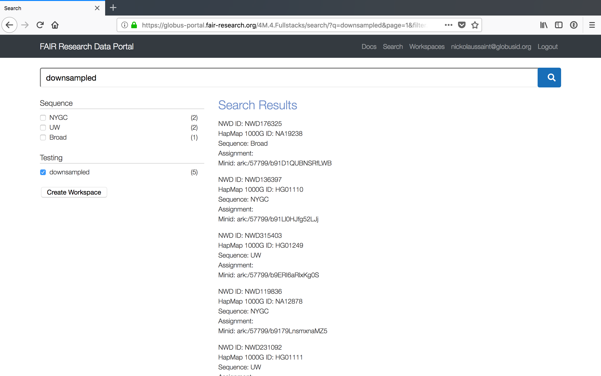

# 4M.4.FULLSTACKS: Cross-stack Compute

## Table of Contents
1. [Quickstart Tutorial](#quickstart-tutorial)
1. [Introduction](#introduction)
1. [Use of Globus Auth Token](#use-of-globus-auth-token)
1. [Globus Genomics WES Interface](#globus-genomics-wes-interface)
1. [Analysis of 5 Downsampled CRAM inputs](#analysis-of-5-downsampled-cram-inputs)
    1. [Using Data Portal](#using-data-portal)
        1. [User Login to FAIR Research Data Portal](#user-login-to-fair-research-data-portal)
        1. [Search Downsampled CRAM](#search)
        1. [Submit Samples](#submit)
    1. [Using CURL from command line](#using-curl-from-command-line)
        1. [Get Globus Token](#get-globus-token)
        1. [JSON Payloads for the 5 downsampled CRAM files](#json-paylods)
        1. [CURL Commands for the 5 downsampled CRAM files](#curl-commands)
    
## Quickstart Tutorial
This quickstart tutorial walks through a quick submission of 5 downsampled TOPMed CRAM input files using a TOPMed Alignment workflow in CWL. It uses a portal to index and search the input datasets and submits to a WES (Workflow Execution Service - GA4GH) service deployed as a shim-layer on the Galaxy based Globus Genomics platform.

* Login to the search portal at: https://globus-portal.fair-research.org/search/ using your Globus credentials
* Search for the 5 downsampled input CRAM files using the search tag "downsampled"
* Select the 5 samples by checking the box next to "downsampled" in the left menu
* Click on "Add Minids" button, which creates a Workspace called "Downsampled Topmed" and adds these 5 samples for analysis
* Then click on the "Start" button for each input CRAM file to initiate the alignment workflow using Globus Genomics backend.
* Typically, after 20-25mins, the analysis of the 5 downsampled inputs should be completed and you should see the resulting BDBag-Minid under the "Output files" column of the workspace. 
The picture below shows a screenshot of the workspace used for the analysis of the 5 input CRAM files

## Introduction
This README describes the implementation of a fullstacks platform that allows to:
* Analyze open access TOPMed WGS data by sharing the same CWL workflow around with other fullstacks
* Scale up the analysis to 5 downsampled, 7 full size WGS open access TOPMed samples and 25 of the remaining 100 samples
* Demonstrate the use of GA4GH Workflow Execution Service (WES) implementation to standardize the workflow execution across multiple fullstacks 
* Build upon the “Workspaces” implemented in 3M.4 Fullstacks demo and add additional features to submit to the WES interface
* Use of Globus auth tokens for user access and user management in Galaxy within Globus Genomics

Some of the highlights of this month’s deliverable are: 
* We indexed the 5 downsampled and 107 open access TOPMed samples within the data portal at https://globus-portal.fair-research.org/workflows/ 
* We implemented a CWL-Runner tool within Galaxy to support CWL workflow execution within Galaxy based Globus Genomics
* We implemented a GA4GH WES service that provides a standard interface to allow CWL based workflow submission and workflow status tracking hiding the Galaxy specific details
* A major feature is the use of Globus auth tokens for user-management on the Galaxy side, thus eliminating the need for a Galaxy API keys used in the previous month deliverables
* Extended the fair research data portal to act as an workflow orchestrator to submit CWL workflows to Globus Genomics via the new WES interface

## Use of Globus Auth Token:
One of the highlights of this deliverable is the use of Globus Auth tokens instead of the Galaxy API Keys to interact with Galaxy. Within the WES implementation, the Globus auth token is used to map the user to the local Galaxy user. If the user doesn’t exist, from within the WES, we create that user using the Galaxy Bioblend API and generate a Galaxy API Key that is then used internally. If the user already exists, we map the Globus Auth token to the user and retrieve the API key and use it to interact with Galaxy. It significantly simplifies the authentication, authorization and the ease of use of our fullstacks platform.

We demonstrate this feature by using the data portal that uses Globus authentication to login. And the portal submits the CWL workflows to the WES interface with the Globus auth tokens in the headers that have the Globus Genomics application scope for further validation. 

## Globus Genomics WES Interface
The GA4GH specificaions for the Workflow Execution Service is available as Swagger UI at: http://ga4gh.github.io/workflow-execution-service-schemas/
The Globus Genomics WES service is implemented to the above specication and the available at: https://nihcommons.globusgenomics.org/wes/service-info

The resources implemented in this WES are:
GET: /service-info
GET: /workflows
POST: /workflows
GET: /workflows/<workflow-id>
DELETE: /workflows/<workflow-id>
GET: /workflows/<workflow-id>/status

Detailed descriptions and usage of each resource is available at: http://ga4gh.github.io/workflow-execution-service-schemas/

## Analysis of 5 Downsampled CRAM inputs

### Using Data Portal
#### User Login to FAIR Research Data Portal
The FAIR Research data portal is available at: https://globus-portal.fair-research.org and users can login using the Login link in the top-right corner. 

When asked for the consent, please allow the portal to access the information and services listed. You will notice that you also allowing access to the Globus Genomics service. The scope to use Globus Genomics is added to the Auth token generated by Globus, which will be presented by the portal to the WES service with Globus Genomics. 

#### Search
The downsampled CRAM files have an annotations of "downsampled" within the data portal. Use the search term "downsampled" in the search box at: https://globus-portal.fair-research.org/search/ 

Select the checkbox next to "downsampled" in the left hand menu as shown in the screenshot below. 

Click on the "Add Minids" button to add the 5 samples to a "Workspace" collection called "Downsampled Topmed" as shown below. 

#### Submit
From within the Workspace, click on each "Start" button to initiate a submission to the WES service.

### Using CURL from command line
#### Get Globus Token
#### JSON Payloads
#### CURL Commands
#### Check Status

