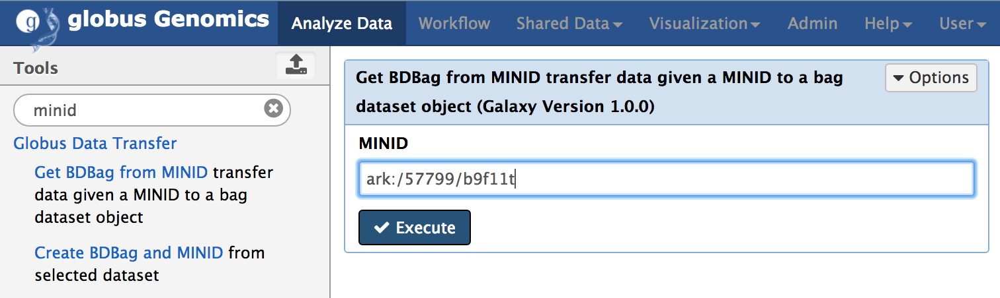
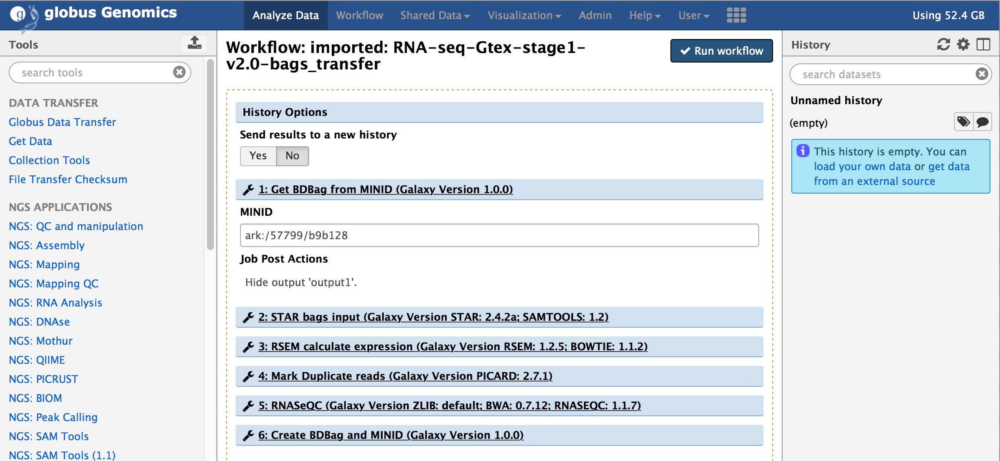
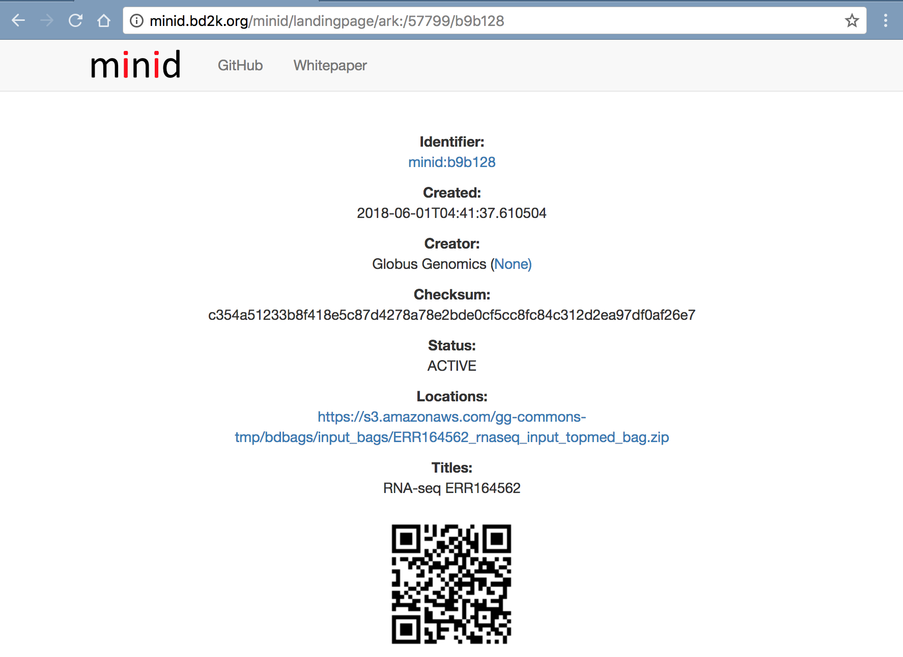

# 2M.1 FULLSTACKS - Implementation of TOPMed RNA-seq pipeline within Globus Genomics using FAIR principles

## Table of Contents
1. [Introduction](#introduction)
1. [Topmed RNAseq workflow](#topmed-rnaseq-workflow)
    1. [Summary](#summary)
    1. [Components](#components)
    1. [Reference Files](#reference-files)
1. [Integration of Minids and BDBags](#integration-of-minids-and-bdbags)
    1. [Get Data using MINID](#get-data-using-minid)
    1. [Publish Results using BDBag MINID](#publish-results-using-bdbag-and-minid)
    1. [Integrate BDBags/Minids with the Topmed RNAseq workflow](#integrate-bdbags-and-minids-with-topmed-rnaseq-workflow)
4. [End-to-end analysis using BDBags as inputs](#end-to-end-analysis-using-bdbags-as-inputs)
    1. [Authentication and Authorization](#authentication-and-authorization)
    1. [Using Python API](#using-python-api)
    1. [Using Globus Genomics Web UI](#using-globus-genomics-web-ui)
5. [List of BDBags](#list-of-bdbags)
    1. [Input Data](#input-data)
    1. [Outputs, Provenance and Performance](#outputs-provenance-and-performance)
    1. [Workflow, Tools and Tool wrappers](#workflow-tools-and-tool-wrappers)
    1. [Tools reference databases](#tools-reference-databases)

## Introduction
This README describes the implementation of TOPMed RNAseq analysis pipeline that uses BDBags and MINID within a Galaxy based Globus Genomics (GG) platform to support FAIR (Findable, Accessible, Interoperable, Reusable) research. We have implemented specific tools within GG that automate the use of MINIDs representing input databags and generate output BDBags along with provenance and performance metric that can be used to validate reproducibility.

## Topmed RNAseq workflow
We selected the TOPMed RNAseq pipeline as described in detail at: https://github.com/broadinstitute/gtex-pipeline/blob/master/TOPMed_RNAseq_pipeline.md
### Summary
For each input sample, this RNAseq pipeline generates:
1. Aligned RNAseq reads (BAM format)
2. Transcriptome BAM generated by STAR
3. QC Metrics on the aligned reads
4. Gene-level expression quantifications based on a collapsed version of a reference transcript annotation, provided as read counts and TPM.
5. Transcript-level expression quantifications, provided as TPM, expected read counts, and isoform percentages

### Components
The figure below describes the RNAseq pipeline and its components:


We have wrapped the following versions of tools within Globus Genomics - Galaxy and we have made all the wrappers available within the [Tools BDBag](#workflow-tools-and-tool-wrappers) with MINID: [ark:/57799/b9t690](http://minid.bd2k.org/minid/landingpage/ark:/57799/b9t690)

The pipeline uses the following individul tools:
* Alignment: [STAR 2.5.3a](https://github.com/alexdobin/STAR/releases/tag/2.5.3a)
  * Post-processing: [Picard 2.9.0](https://github.com/broadinstitute/picard) [MarkDuplicates](https://broadinstitute.github.io/picard/command-line-overview.html#MarkDuplicates)
* Gene quantification and quality control: [RNA-SeQC 1.1.9](https://github.com/francois-a/rnaseqc)
* Transcript quantification: [RSEM 1.3.0](https://deweylab.github.io/RSEM/)
* Utilities: [SAMtools 1.6](https://github.com/samtools/samtools/releases) and [HTSlib 1.6](https://github.com/samtools/htslib/releases)

### Reference files
The tools listed above require Reference genomes. Following GRCh38 reference genome are used currently. We have created a [References BDBag](#tools-reference-databases) with all the reference databases in it. It can be accessed using the MINID: [ark:/57799/b9ph5b](http://minid.bd2k.org/minid/landingpage/ark:/57799/b9ph5b).

* Reference genome for RNA-seq alignment using STAR (contains .fasta, .fai, and .dict files): [Homo_sapiens_assembly38_noALT_noHLA_noDecoy_ERCC.tar.gz](https://personal.broadinstitute.org/francois/topmed/Homo_sapiens_assembly38_noALT_noHLA_noDecoy_ERCC.tar.gz)
* Collapsed gene model GTF: [gencode.v26.GRCh38.ERCC.genes.gtf.gz](https://personal.broadinstitute.org/francois/topmed/gencode.v26.GRCh38.ERCC.genes.gtf.gz)
* STAR index database: [STAR_genome_GRCh38_noALT_noHLA_noDecoy_ERCC_v26_oh100.tar.gz](https://personal.broadinstitute.org/francois/topmed/STAR_genome_GRCh38_noALT_noHLA_noDecoy_ERCC_v26_oh100.tar.gz)
* RSEM reference database: [rsem_reference_GRCh38_gencode26_ercc.tar.gz](https://personal.broadinstitute.org/francois/topmed/rsem_reference_GRCh38_gencode26_ercc.tar.gz)

## Integration of MINIDs and BDBags
We have added new tools within Globus Genomics to support the use of MINIDs and BDBags. We have specifically added two tools - 1) Get BDBag using MINID, and 2) Create BDBag and MINID 
### Get BDBag using MINID
Get BDBag using MINID is a new Galaxy tool we have added to GG that downloads all the data within the BDBag and adds it to Galaxy history. The following figure shows the tool withn GG.


### Publish results using BDBag and MINID
Create BDBag and MINID is a tool takes any history items or outputs of the tools and creates a BDBag and publishes it. It returns a MINID referencing the BDBag created. The following figure shows the tool within GG.


### Integrate BDBags and Minids with Topmed RNAseq workflow
In order to provide an end-to-end automation of running the TOPMed RNAseq pipeline by using a MINID as input, we integrated the two tools within the RNAseq workflow shown above in [Section 2/Components](#components). The resulting workflow is shown below:


"Get BDBag using MINID" transfers all the data referenced by the MINID and feeds it into the first tool of the pipeline for analysis. 

And the last step in the pipeline, "Create BDBag and MINID" takes the outputs of the workflow that are marked (orange stars in the above screenshot) and creates a new BDBag and generates a MINID for the bag. In addition to capturing the outputs of the analysis, this tools also collects provenance data in the form of actual command-lines with arguments that were used to run the tools, and performance metrics in the form of times taken to run the tools, and adds them to the new BDBag it creats. And example of the output BDBag is provided below under [section 5(ii).](#outputs-provenance-and-performance)

## End-to-end analysis using BDBags as inputs
In this section we will describe how we can easily access the input data using a MINID and a pipeline required to run a RNAseq analysis and then validate if the results are as expected. Using Globus Genomics we will demonstate how we can run this RNAseq pipeline using an [input MINID](#input-data) in different modes. We will also describe how the outputs generated by the users can be validated and compared to ensure reproduciblity of the results using BDBag infrastrcture.

### Authentication and Authorization
Authentication and Authorization to access the [NIH-Commons Globus Genomics instance](https://nihcommons.globusgenomics.org/) is a two step process. 
1. Create Globus ID: Create a Globus account at https://www.globusid.org/. The NIH-Commons Globus Genomics instance is made available to all the user witha Globus ID. 
2. Create Access API Key: Using the Globus ID, login to http://nihcommons.globusgenomics.org and from the top menu, go to User Preferences and click on "Manage API Key", as shown below. If you don't yet have a key, click on "Create new Key" button to create a new access key.
An API key will allow you to access via web API. Please note that this key acts as an alternate means to access your account and should be treated with the same care as your login password.


### Using Python API
We have created a python script that uses Galaxy's Bioblend API to run the workflow. It takes the MINID as input and run the workflow, and polls the status until the analysis is completed. After completion, the script returns a MINID for the outputs BDBag created at the end of the analysis. Each analysis creates a new outputs BDBag. Users can use the returned MINID to compare the outputs against the Outputs BDBag with MINID [ark:/57799/b9x12j](#outputs-provenance-and-performance) shown below to verify the reproducibility of the results. 

Note: The python script requires the Access API Key generated in Step 2 above under Authentication and Authorization section.

We have created a MINID for the Python script at: 

The Python script can run as follows:
1. Create a Virtual Env:
```python
$> virtualenv bioblend_env
$> source bioblend_env/bin/activate
```
2. Install Bioblend Module
```python
$> pip install bioblend
```
3. Download the Python script (using the Minid:  or direct download)
```
$> wget https://raw.githubusercontent.com/fair-research/fair-genomics/master/submit_topmed_rna_seq.py
$> python submit_topmed_rna_seq.py --help
Usage: submit_topmed_rnaseq_workflow.py -k <API_KEY> --input-minid <INPUT_MINID>

Options:
  -h, --help            show this help message and exit
  -k API_KEY, --key=API_KEY
                        User API Key
  -m INPUT_MINID, --input-minid=INPUT_MINID
                        Input MINID containing BDBag of paired-ended fastq
                        files

$> python submit_topmed_rna_seq.py -k xxxxxxxxxxxxxxxxxx -m ark:/57799/b9b128
SUBMITTED	ark:/57799/b9b128	imported: RNA-seq-Gtex-stage1-v2.0-bags_transfer	801d769120b6adcb	topmed_history_Fri_Jun_01_2018_12:13:21_AM	29015fce37680443
Workflow running: Fri_Jun_01_2018_12:13:23_AM
.........
```

### Using Globus Genomics Web UI
**Step-1: Login:** 
Using Globus ID, login to the NIH-Commons Globus Genomics instance at: https://nihcommons.globusgenomics.org

**Step-2: Create Access API Key**
If you have not alredy done it (as per Authentication and Authorization section). Please create the access API Key from "User->Preferences->Manage API Key" in the top menu.

**Step-3: Import the workflow:** 
From the top-menu, go to "Shared Data -> Workflows". Select the workflow named "RNA-seq-Gtex-stage1-v2.0-bags_transfer" and click "import" to import the workflow into you account. 


You should see the imported workflow under the "Workflow" link from the top menu.


**Step-4: Run the workflow:** 
Select the imported workflow from the "Workflow" menu item and click on "Run".


You will notice that the workflow only takes one input, the MINID for the [input data BDBag](#input-data): ark:/57799/b9f11t as shown in the screenshot below:



Provide the MINID in the input text box of the first step in the workflow and click on "Run Workflow".


The workflow will be submitting within Galaxy and all the tasks will be added to the history. The steps within the workflow will start running one after another based on the depencies. The first step in the workflow, "Get BDBag from MINID" will download the input sample represented by the BDBag ([ark:/57799/b9b128](#input-data)). In this case, it is just one sample that is downloaed. After the download is complete, it will run all the steps one-by-one to complete the analysis and finally the "Create BDBag and MINID" step will run, that will create a new BDBag with all the outputs, provenance, and performance files in the bag. 

## List of BDBags
### Input Data

http://minid.bd2k.org/minid/landingpage/ark:/57799/b9b128



### Outputs, Provenance and Performance

http://minid.bd2k.org/minid/landingpage/ark:/57799/b9x12j


### Workflow, Tools and Tool wrappers

http://minid.bd2k.org/minid/landingpage/ark:/57799/b92q4f


http://minid.bd2k.org/minid/landingpage/ark:/57799/b9t690


### Tools reference databases

http://minid.bd2k.org/minid/landingpage/ark:/57799/b9ph5b


